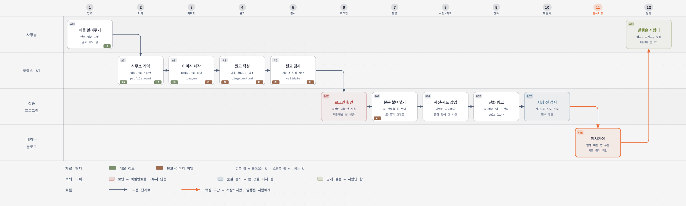

# Naver Realtor Blog Pro

매물 정보를 말하면, AI가 **네이버 블로그 매물 글을 사진·표·지도·전화 배너까지
갖춰서 만들고, 임시저장까지** 해주는 도구입니다. 사장님이 하는 일은 딱 두 가지 —
처음에 매물을 설명하는 것, 마지막에 발행 버튼을 누르는 것입니다.

## 한 장으로 보는 전체 흐름



왼쪽 위에서 시작해 화살표만 따라가면 됩니다. 사장님(1번)이 매물을 알려주면
코덱스 AI가 글과 이미지를 만들고(2~5번), 전송 프로그램이 네이버 편집기에
옮겨서(6~10번) **임시저장(11번, 주황색)** 하고 멈춥니다. 발행(12번)은 다시
사장님에게 돌아옵니다.

> 같은 내용을 더 크게 보고 싶으면
> [docs/how-it-works.html](naver-realtor-blog-pro/docs/how-it-works.html)을
> 브라우저로 여세요.

## 이 도구가 절대 하지 않는 것 3가지

먼저 안전 약속부터 말씀드립니다. 이 도구는 —

1. **발행하지 않습니다.** 누르는 버튼은 임시저장 하나뿐이고, 발행·예약발행을
   누르는 코드는 아예 들어있지 않습니다. 글이 세상에 공개되는 건 사장님이
   발행 버튼을 눌렀을 때뿐입니다.
2. **비밀번호를 다루지 않습니다.** 아이디·비밀번호·인증번호를 묻지도, 받지도,
   저장하지도 않습니다. 로그인은 언제나 사장님이 브라우저 창에서 직접 합니다.
3. **지어내지 않습니다.** 사장님이 말한 사실과 매물 페이지에 적힌 사실만
   씁니다. 모르는 값은 비워두거나 "확인 필요"라고 적지, 그럴듯하게 채우지
   않습니다. "역까지 5분" 같은 말도 사장님이 말해주지 않으면 안 씁니다.

## 처음 한 번만 하는 준비 2가지

### ① 네이버 로그인 (약 2주에 한 번)

아래 한 줄을 복사해서 터미널(코덱스 창)에 붙여넣으세요:

```bash
node naver-realtor-blog-pro/scripts/login-setup.mjs
```

브라우저 창이 하나 뜹니다. 거기서 평소처럼 네이버에 로그인하면 끝입니다.
(`로그인 상태 유지`에 체크하세요.) 이 로그인은 도구 전용 브라우저에 약 2주간
유지되므로, 그동안은 매물 글을 몇 개를 만들든 다시 로그인할 일이 없습니다.
2주쯤 지나 만료되면 도구가 "다시 로그인해 주세요"라고 알려줍니다.

### ② 사무소 정보 (딱 한 번)

첫 매물 글을 시킬 때 이렇게 한 줄 끼워 넣으면 됩니다:

> "나 포동 공인중개사에서 일하는 민경식이야. 상담 전화는 010-1234-5678이고."

도구가 이 정보를 설정 파일에 적어두고, **다음 매물부터는 다시 묻지 않습니다.**
"상담 전화는 지난번이랑 같아"라고만 해도 알아서 찾아 씁니다. 이 정보는
썸네일의 사무소명, 전화 배너의 번호, 글 끝의 전화 링크에 쓰입니다.

## 매물 글 하나 만들기 — 이렇게 말하면 됩니다

코덱스에서 `$naver-realtor-blog-pro`를 부르고, 매물을 설명하세요.
정해진 양식은 없습니다. 아는 것만, 말하듯 쓰면 됩니다:

> "파주에 창고 매물 하나 잡았는데 블로그 글 만들어서 임시저장까지 해줘.
> 공장·창고 매매고 23억. 파주시 상지석동이고 운정역 근처야.
> 전용 180평, 대지 497평, 단층에 층고 8.5미터.
> 2020년 사용승인 받은 준신축이고 40피트 트레일러 들어가.
> 사진은 이 폴더에 있어: /Users/…/photos/
> 내 블로그 아이디는 mks010103이야."

사진이 있으면 폴더 위치를 알려주고, 각 사진이 뭘 찍은 건지 한 줄씩 적어주면
글이 훨씬 좋아집니다 (예: "01번은 외관, 07번은 내부, 15번은 화장실").
중요한 정보가 빠졌으면 도구가 **한 번에 모아서** 되묻고, 그 뒤로는 끝까지
혼자 갑니다.

## 그다음 무슨 일이 일어나나요 — 12단계 전부

### 1부. AI가 글을 만듭니다 (1~5단계)

**1. 매물 알려주기** — 사장님이 위처럼 말합니다. 매물번호만 던져도 되고,
말로 설명해도 되고, 다른 매물 사이트 주소를 줘도 됩니다(그 페이지에 적힌
사실만 가져옵니다).

**2. 사무소 기억** — 사무소명·성함·전화가 처음이면 설정 파일에 적어두고,
이미 있으면 그냥 꺼내 씁니다. 그래서 두 번째 매물부터가 진짜 편합니다.

**3. 이미지 제작** — 글 맨 위에 넣을 **썸네일**(매물명과 사무소명이 큼직하게
박힌 정사각형 이미지)과 글 맨 아래에 넣을 **전화 상담 배너**(전화번호가
크게 적힌 가로 배너)를 AI가 새로 그립니다. 배너는 한 번 만들면 다음 글부터
재사용합니다. 이미지가 실패해도 글쓰기는 멈추지 않습니다.

**4. 원고 작성** — 제목 → 도입 → 매물에 맞는 본문 챕터 2~4개 → 위치 →
핵심 조건 표 → 상담 안내 → 태그 순서로 원고를 씁니다. 핵심은 **챕터가 매물을
따라간다**는 것입니다. 창고면 "물류 진입과 주차·내부 홀" 같은 챕터가 생기고,
원룸이면 "공간과 옵션" 챕터가 생깁니다. 화장실 사진이 있으면 화장실 문단이
생기고, 현관 없는 매물에 현관 챕터를 만들지 않습니다. 보증금·면적 같은
숫자는 한눈에 보이게 **2열 표**로 정리합니다.

**5. 원고 검사** — 사람 눈이 아니라 **검사 프로그램**이 원고를 봅니다.
한 줄에 문장이 하나인지(휴대폰 가독성), "검색량 많음·상위노출 보장" 같은
근거 없는 말이 섞였는지, 지도에 표시할 위치가 적혔는지, 굵기 강조를
남발했는지를 기계적으로 확인합니다. 걸리면 고치고 재검사한 뒤에야 다음
단계로 갑니다.

### 2부. 프로그램이 네이버에 옮깁니다 (6~11단계)

여기부터는 AI가 아니라 **미리 짜둔 전송 프로그램**이 일합니다. 사람이
브라우저에서 하는 동작(클릭·붙여넣기·업로드)을 그대로, 다만 수 초 만에
합니다. 브라우저 창이 실제로 떠서 눈으로 지켜볼 수도 있습니다.

**6. 로그인 확인** — 준비 ①에서 저장된 로그인 상태를 확인만 합니다.
만료됐으면 "다시 로그인해 주세요" 하고 멈춥니다. 비밀번호는 절대 다루지
않습니다.

**7. 본문 붙여넣기** — 제목을 치고, 본문 전체(문단·소제목·표·굵기·형광펜)를
**한 번의 붙여넣기**로 넣습니다. 사람이 복사–붙여넣기 하는 것과 같은
방식이라 표 테두리와 글자 서식이 그대로 살아 들어갑니다. 사진과 지도가
들어갈 자리에는 **예약석 표시**만 해둡니다.

**8. 사진·지도 삽입** — 예약석을 위에서부터 하나씩 찾아가 그 자리에 진짜
사진을 업로드하고, 위치 챕터의 예약석에는 네이버 지도를 붙입니다. 그래서
화장실 문장 옆에 화장실 사진이, 위치 문장 아래에 지도가 정확히 놓입니다.
사진 한 장이 실패해도 전체가 멈추지 않고, 빠진 것은 마지막에 보고됩니다.

**9. 전화 링크** — 글 끝에 "전화 상담: 010-…" 줄을 만들어 **누르면 전화가
걸리는 링크**를 달고, 전화 배너 **이미지에도 같은 링크**를 겁니다. 발행
후에 손님이 휴대폰에서 글자든 배너든 탭하면 바로 사장님 번호로 전화가
걸립니다.

**10. 저장 전 검사** — 저장 버튼을 누르기 전에 프로그램이 **쓴 것을 다시
셉니다.** 사진이 원고에 적힌 수만큼 들어갔는지, 표와 지도가 실제로 있는지,
예약석 표시가 안 지워지고 남았는지, 전화 링크가 진짜 걸렸는지. 하나라도
어긋나면 결과 보고에 그대로 적힙니다. "됐다고 치는" 일이 없습니다.

**11. 임시저장 — 여기서 멈춥니다** — 프로그램이 누르는 버튼은 **임시저장
하나뿐**입니다. 누른 뒤에는 임시저장 글 개수가 실제로 하나 늘었는지
**증거를 확인**하고 나서야 "저장 완료"라고 보고합니다. 확인이 안 되면
"저장은 눌렀는데 확인은 못 했다"라고 정직하게 말합니다.

### 3부. 다시 사장님 차례입니다 (12단계)

**12. 발행은 사람이** — 네이버 블로그 글쓰기 화면에서 시계 모양(임시저장
목록)을 눌러 방금 저장된 글을 엽니다. **직접 읽어보고, 고칠 게 있으면
고치고, 발행 버튼을 누르세요.** 매물 광고는 사장님 이름으로 나가는
글이니까요. 발행 후 휴대폰에서 전화 배너를 한 번 탭해보면 전화 연결까지
확인됩니다.

## 결과는 이렇게 알려줍니다

전송이 끝나면 네 가지 중 하나로 보고합니다. 애매한 말로 얼버무리지 않습니다:

| 보고 | 뜻 | 사장님이 할 일 |
|---|---|---|
| `SAVED` | 임시저장 확인됨 (글 개수 증가까지 확인) | 열어보고 발행 |
| `UNVERIFIED` | 저장은 눌렀는데 확인 신호를 못 봄 | 임시저장 목록을 직접 확인 |
| `BLOCKED` | 로그인이 필요해서 멈춤 | 준비 ①의 로그인 한 줄 실행 |
| `FAILED` | 실패 — 원고 파일은 그대로 남아 있음 | 그대로 한 번 더 시켜보기 |

같은 매물을 다시 시키면 같은 제목의 임시저장이 하나 더 생깁니다. 그럴 땐
**저장 시각이 가장 최신인 것**을 열면 됩니다. 필요 없는 임시저장 정리는
사장님이 직접 하세요 — 이 도구는 어떤 삭제 버튼도 누르지 않습니다.

## 뭔가 이상할 때

- **"다시 로그인해 주세요"라고 나옴** → 2주가 지나 세션이 만료된 것.
  준비 ①의 한 줄을 다시 실행하고 로그인하면 됩니다.
- **글이 두 개 생김** → 다시 시켰을 때 정상입니다. 최신 것을 쓰세요.
- **사진 한 장이 빠짐** → 보고에 적힌 그 사진만 편집기에서 직접 넣으면
  됩니다. 나머지는 이미 들어가 있습니다.
- **네이버 화면이 바뀌어서 안 됨** → `config/selectors.yaml` 파일 하나만
  고치면 됩니다(강의에서 다룹니다). 고치는 동안에는 fast 스킬의 전송이
  대신 동작합니다.

## 나에게 맞게 바꾸기

설정은 전부 파일 하나에 모여 있습니다: `~/.codex/naver-realtor-blog/profile.yaml`

- 사무소명·성함·전화 — 한 번 기억된 뒤에도 여기서 직접 고칠 수 있습니다
- 글 말투 — 담백형(기본)·친근형·정보형 중 선택
- 내 기존 블로그 글 5개를 학습시켜 내 말투로 쓰게 할 수도 있습니다
  (같은 계열 [naver-realtor-blog](https://github.com/Dr-Min/naver-realtor-blog-skill) 스킬의 기능)

## fast 뼈대와의 관계

이 스킬은 [fast 뼈대](https://github.com/Dr-Min/naver-realtor-blog-fast)의
다섯 자리 중 세 자리를 갈아끼운 확장판입니다:

| 자리 | fast | pro |
|---|---|---|
| 입력 | 자연어 매물 사실 | **매물번호 또는 자연어 또는 매물 페이지 주소** |
| 이미지 | 사용자 제공 사진 | + **썸네일·전화 배너 자동 생성** |
| 전송 | AI가 브라우저 조작 | **전송 프로그램 (수 초, AI 비용 0)** |

코어 계약 6가지(사실 무결성·권한 경계·단일 원본·기계 검증·정직한 종료·
무중단 완주)는 그대로이며, 어기면 테스트가 잡아냅니다.
